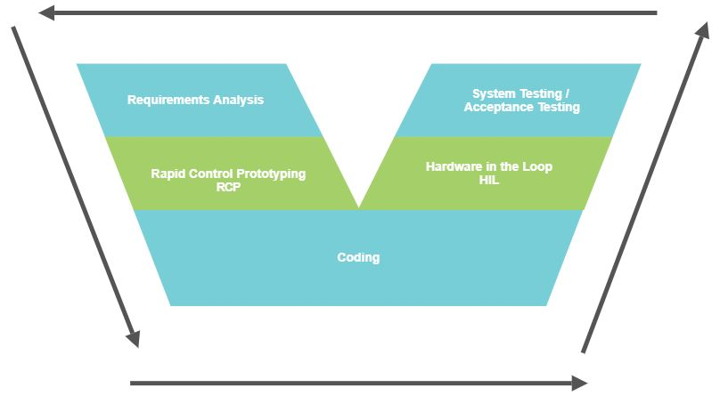

<!--
 * @Author       : Jingsheng Lyu
 * @Date         : 2020-08-29 12:16:47
 * @LastEditors  : Jingsheng Lyu
 * @LastEditTime : 2020-08-31 23:14:36
 * @FilePath     : /undefined/home/jingsheng/ControlAlgorithm_using_ROSandMatlab/README.md
 * @Github       : https://github.com/jingshenglyu
 * @Web          : https://jingshenglyu.github.io/
 * @E-Mail       : jingshenglyu@gmail.com
-->
# ControlAlgorithm_using_ROSandMatlab
How to develop the control algorithm using ROS and Matlab

# Why should we use Matlab/Simulink for the development of control algorithm?
1. Using **Toolboxs** for achievement rapidly
2. The process for development with Simulink is the same as our mind.
3. Generate the C++ Code automatically
4. Using the simulation's model in Windows

# How to achieve the controlling algorithm using Matlab and ROS?

## 1. Toolbox of Matlab/Simulink and ROS Command
## 2. Control the virtual robot with Matlab/Simulink
## 3. Generate the C++ Code with Matlab/Simulink to achieve the controlling algorithm
## 4. Control the robot model with ROS
## 5. Engineering Project
* V-Model
    


## 1. Introduction Toolboxs
* prepare 
    * Matlab 2020a in Ubuntu 18.04 LTS
    * ROS in Ubuntu 18.04 LTS

### 1.1 Check the ip-address for Ubuntu
* If you don't have the net-tools on your Ubuntu
    ```
    sudo apt install net-tools
    ```

* Then check the ip-address 
    ``` 
    ifconfig -a
    ```
    >Note: You will see the ip-address(after *inet*, begin with 192.168.X.X)
    
### 1.2 Write down the ip-address
* Write down the ROS_IP in .bashrc file
    ```
    vi .bashrc
    ```
    >Note: You should add `export ROS_IP = 192.168.X.X` to the end of the .bashrc file
    ```
    roscore
    ```
    >Note: You will see the ROS_MASTER_URI is the same as your setting.

### 1.3 Build up the communication between ROS and Matlab
* Goto the Matlab, set up the enviroment in workspace
    ```
    >> setenv('ROS_MASTER_URI','http://192.168.2.107:11311/')
    >> rosinit
    ```
    >Note: Using `help ros` to check more command for ROS in Matlab

* Example: 
    You can try to input the command not only in Matlab's workspace but also in the Terminal of Ubuntu 18.04
    ```
    >> rostopic list
    /rosout    
    /rosout_agg
    >> rosnode list
    /matlab_global_node_86375
    /rosout
    ```
    >Note: Matlab is also a **ROS node**.

### 1.4 Run a model 
* Start the simulation for the turtle in ROS
    ```
    rosrun turtlesim turtlesim_node
    ```
* Run the model, check the model by `ROS_Matlab.m` in the folder of the .m file
    ```
    >> ROS_Matlab
    ```
### 1.5 Shut down the communication
* Shut down the communication between ROS and Matlab
    ```
    >> rosshutdown
    ```  


    